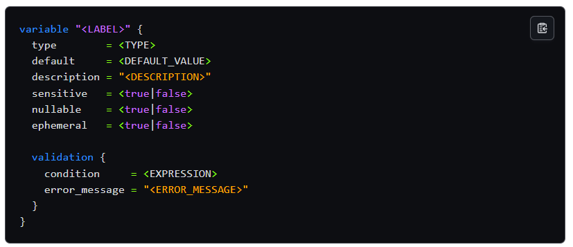

# Terraform Variables

A comprehensive guide to understanding and using Terraform variables to parameterize your infrastructure configurations.



---

## 📖 Background

The `variable` block is similar to a function argument in other programming languages. Input variables let you customize Terraform modules without altering their source code. Variables serve as parameters for modules, making them **composable** and **reusable**.

You can define variables in:

| Module Type | How Values Are Set |
|-------------|-------------------|
| **Root modules** | CLI options, environment variables, variable definition files, or HCP Terraform workspace |
| **Child modules** | Parent module passes values as arguments to the `module` block |

---

## 🎯 Three Types of Variables

### 1. Input Variables (variables.tf)
Values you provide to Terraform - like function parameters

```hcl
variable "environment" {
  description = "Environment name"
  type        = string
  default     = "staging"
}
```

### 2. Local Variables (locals.tf)
Internal computed values - like local variables in programming

```hcl
locals {
  common_tags = {
    Environment = var.environment
    Project     = "Terraform-Demo"
  }

  resource_prefix = "${var.environment}-${var.project_name}"
}
```

### 3. Output Variables (output.tf)
Values returned after deployment - like function return values

```hcl
output "resource_id" {
  description = "The ID of the created resource"
  value       = aws_instance.example.id
}
```

---

## 📥 Understanding Input Variables in Detail

### What are Input Variables?
Input variables allow you to customize your Terraform configuration without hardcoding values. They make your modules reusable across different environments and use cases.

### Variable Block Arguments

| Argument | Description |
|----------|-------------|
| `description` | Documents the variable's purpose |
| `type` | Specifies the type constraint (string, number, bool, list, map, object) |
| `default` | Default value if none is provided |
| `validation` | Custom validation rules |
| `sensitive` | Marks variable as sensitive (hides from output) |
| `nullable` | Whether the variable can be null |

### Basic Input Variable Structure

```hcl
variable "variable_name" {
  description = "What this variable is for"
  type        = string
  default     = "default_value"  # Optional
  sensitive   = false            # Optional
}
```

### How to Use Input Variables

```hcl
# Define in variables.tf
variable "environment" {
  description = "Environment name (dev, staging, prod)"
  type        = string
  default     = "staging"
}

variable "instance_type" {
  description = "EC2 instance type"
  type        = string
  default     = "t2.micro"
}

# Reference with var. prefix in main.tf
resource "aws_instance" "example" {
  instance_type = var.instance_type

  tags = {
    Environment = var.environment
  }
}
```

### Providing Values to Input Variables

**1. Default values (in variables.tf)**

```hcl
variable "environment" {
  default = "staging"
}
```

**2. terraform.tfvars file (auto-loaded)**

```hcl
environment   = "demo"
instance_type = "t2.small"
```

**3. Command line**

```bash
terraform plan -var="environment=production"
```

**4. Environment variables**

```bash
export TF_VAR_environment="development"
terraform plan
```

---

## 📤 Understanding Output Variables in Detail

### What are Output Variables?
Output variables display important information after Terraform creates your infrastructure. They can also be used to pass data between modules.

### Output Block Arguments

| Argument | Description |
|----------|-------------|
| `description` | Documents the output's purpose |
| `value` | The value to output (required) |
| `sensitive` | Marks output as sensitive |
| `depends_on` | Explicit dependencies |

### Basic Output Variable Structure

```hcl
output "output_name" {
  description = "What this output shows"
  value       = resource.resource_name.attribute
}
```

### How to Use Output Variables

```hcl
# Output a resource attribute
output "instance_id" {
  description = "ID of the EC2 instance"
  value       = aws_instance.example.id
}

output "instance_public_ip" {
  description = "Public IP of the EC2 instance"
  value       = aws_instance.example.public_ip
}

# Output an input variable
output "environment" {
  description = "Environment from input variable"
  value       = var.environment
}

# Output a local variable
output "tags" {
  description = "Tags from local variable"
  value       = local.common_tags
}
```

### Viewing Outputs

```bash
terraform output                    # Show all outputs
terraform output instance_id        # Show specific output
terraform output -json              # Show all outputs in JSON format
```

---

## 🚀 Variable Precedence

Terraform loads variables in the following order (later sources override earlier ones):

| Priority | Source | Example |
|----------|--------|---------|
| 1 (Lowest) | Default values | `default = "staging"` in variables.tf |
| 2 | Environment variables | `export TF_VAR_environment="dev"` |
| 3 | terraform.tfvars | Auto-loaded file |
| 4 | *.auto.tfvars | Auto-loaded files (alphabetical order) |
| 5 | -var-file | `terraform plan -var-file="prod.tfvars"` |
| 6 (Highest) | -var flag | `terraform plan -var="environment=prod"` |

### Testing Precedence

```bash
# 1. Default Values (temporarily hide terraform.tfvars)
mv terraform.tfvars terraform.tfvars.backup
terraform plan
# Uses default from variables.tf
mv terraform.tfvars.backup terraform.tfvars

# 2. Using terraform.tfvars (automatically loaded)
terraform plan
# Uses values from terraform.tfvars

# 3. Command Line Override (highest precedence)
terraform plan -var="environment=production"
# Overrides all other sources

# 4. Environment Variables
export TF_VAR_environment="from-env-var"
terraform plan
# Uses environment variable

# 5. Using Different tfvars Files
terraform plan -var-file="dev.tfvars"
terraform plan -var-file="production.tfvars"
```

---

## 📁 File Structure

```
├── main.tf           # Resource definitions
├── variables.tf      # Input variable declarations
├── locals.tf         # Local variable definitions
├── output.tf         # Output variable declarations
├── provider.tf       # Provider configuration
├── terraform.tfvars  # Default variable values
└── README.md         # Documentation
```

---

## 🔧 Common Commands

```bash
# Initialize
terraform init

# Plan with defaults
terraform plan

# Plan with command line override
terraform plan -var="environment=test"

# Plan with different tfvars file
terraform plan -var-file="dev.tfvars"

# Apply and see outputs
terraform apply
terraform output

# Clean up
terraform destroy
```

---

## 💡 Key Takeaways

| Variable Type | Purpose | Syntax |
|--------------|---------|--------|
| **Input variables** | Parameterize your configuration | `var.name` |
| **Local variables** | Compute and reuse values internally | `local.name` |
| **Output variables** | Export values after deployment | `output "name"` |

**Variable Precedence:** `-var` > `-var-file` > `*.auto.tfvars` > `terraform.tfvars` > Environment vars > Defaults
